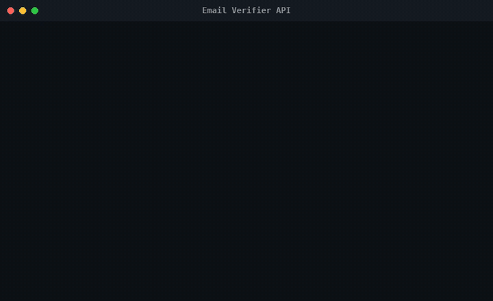

<h1 align="center">Email Verifier API</h1>

<p align="center">
  Check an email address's syntax, then whether its domain publishes DNS mail exchangers.
</p>

<p align="center">
  <a href="#features">Features</a> ·
  <a href="#quick-start">Quick start</a> ·
  <a href="#how-it-works">How it works</a> ·
  <a href="#project-notes">Project notes</a>
</p>

<p align="center">
  
  
  
  
</p>

<p align="center">
  
</p>

This Express API checks an address's basic syntax and looks up MX records for its domain. It is a small local service for demonstrating email-domain checks, not mailbox verification: a successful result does not prove that the mailbox exists or can receive mail.

## Features

- **Format check before DNS.** Missing input returns HTTP 400, and anything that fails the basic format check (text, an `@`, a domain with a dot) is rejected before any DNS lookup.
- **Ordered MX results.** MX records are sorted by ascending priority and returned with the domain and validation flags.
- **Expected DNS negatives.** `ENOTFOUND` and `ENODATA` return a normal negative result with an empty MX list. Other DNS errors are passed to the Express error handler.
- **Repeatable API tests.** Jest and Supertest cover the routes and validation behavior; DNS results are mocked in tests.

## Quick start

Prerequisites: Node.js and npm.

```bash
git clone https://github.com/cl0ax/email-verifier-api.git
cd email-verifier-api
npm install
npm test
PORT=5050 npm start
```

The default port is 5000, but macOS often has it taken by AirPlay, so the example uses 5050. In another terminal, query the API:

```bash
curl 'http://localhost:5050/api/validate-email?email=hello@gmail.com'
```

The endpoint is `GET /api/validate-email?email=name@example.com`. Invalid syntax and domains without MX records return HTTP 200 with `isValid: false`; a missing or blank `email` parameter returns HTTP 400.

## How it works

The Express route in `src/api/index.js` trims and checks the query value first. Only addresses that pass the basic format check reach `dns.promises.resolveMx`; the route sorts returned records and maps expected `ENOTFOUND` or `ENODATA` errors to a negative result. Unexpected failures continue to the error middleware in `src/middlewares.js`. `src/app.js` configures the API and middleware, while `src/index.js` starts the server and reads `PORT`.

The Jest suite in `test/` uses Supertest to exercise the app. It mocks MX lookup results so test outcomes do not depend on live DNS.

## Project notes

I started this from the `express-api-starter` template and built the verifier on top of it; the template's `/api/emojis` example route is still there. It runs locally; there is no hosted instance. The format check is deliberately basic, and an MX record only means the domain accepts mail, not that a particular mailbox exists.

License: [MIT](LICENSE). The license retains the original scaffold copyright notice.
